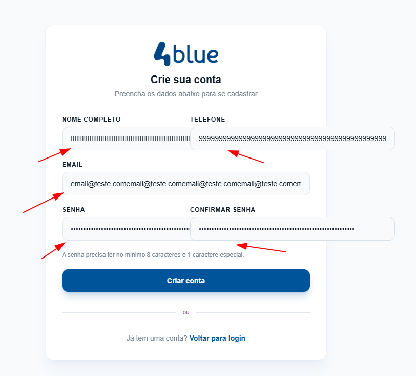
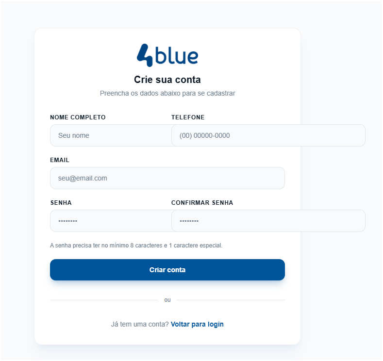
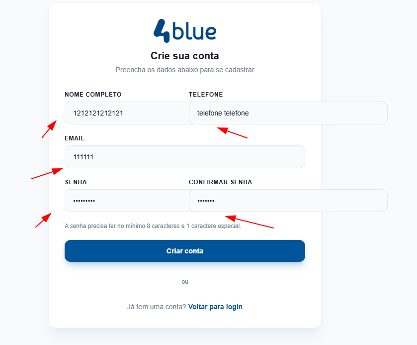
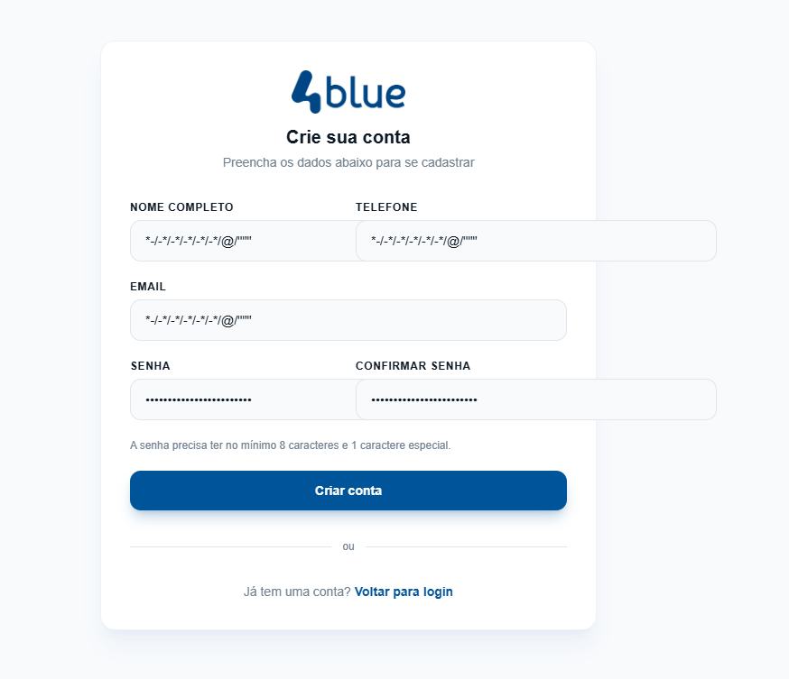
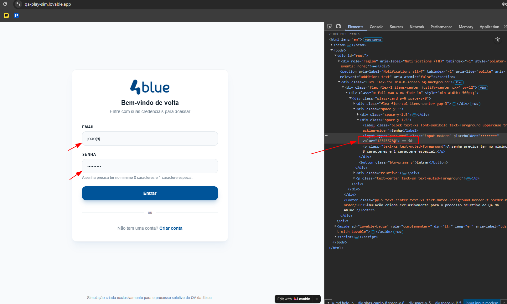
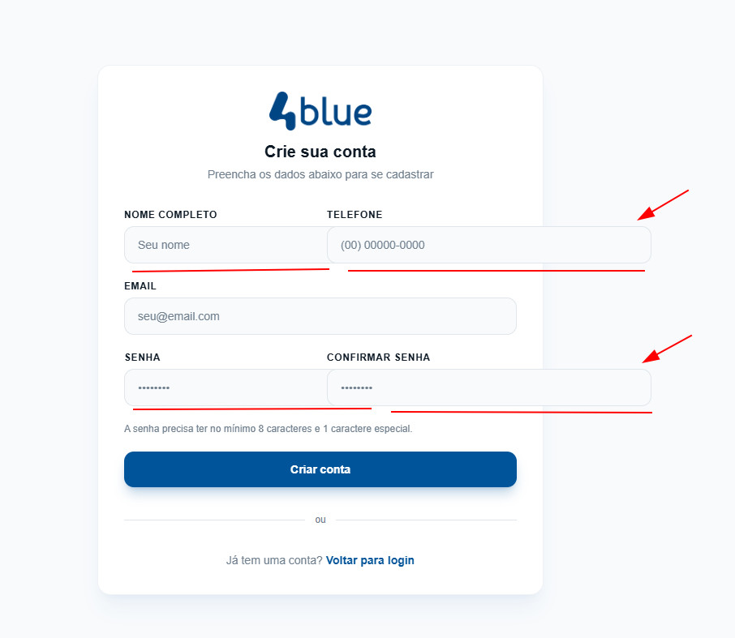
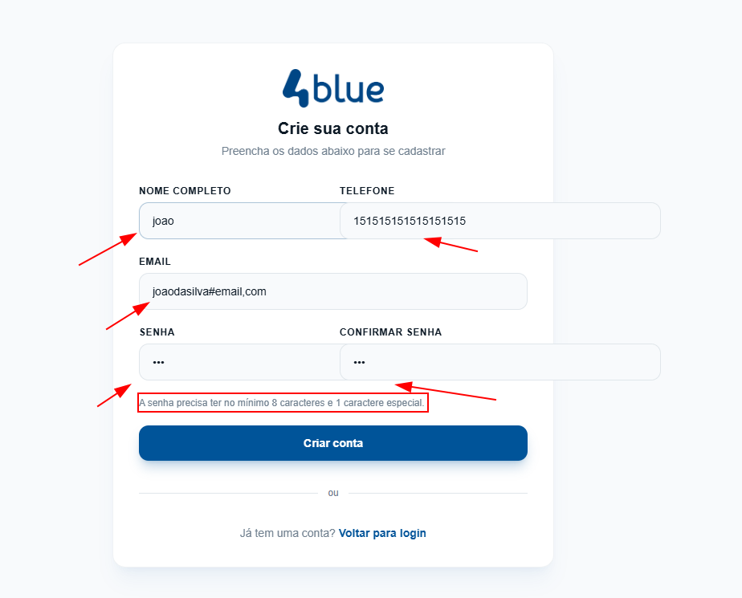

# Relatório de Testes – Microssistema 4blue

Responsável: Felipe Silva – QA Tester

Data da execução: 08/03/2026

Ambiente testado: https://qa-play-sim.lovable.app/

Navegador: Chrome 145.0.7632.160 (64-bit)

Dispositivo: Desktop – Windows 11

Tipo de teste: Teste exploratório, funcional, validação de formulário, segurança básica e UX

Escopo: Cadastro, Login, Redirecionamento, Validações de Formulário, Segurança e UX

Obs.: vídeos poderão ser acessados via diretorio do git ou download do Google Drive.

------------------------------------------------------------------------------------------------------------------------------------------

# 1. Bugs Encontrados
A seguir, os bugs identificados durante a execução dos testes.
Cada item contém: título, descrição, passos, resultado atual, resultado esperado, severidade e prioridade.

## Teste: Cadastro de usuário
### Descrição: BUG 001 - Campos de cadastro sem limite de caracteres
o Passos para reproduzir
- acessar a plataforma https://qa-play-sim.lovable.app/
- clicar no botão “Criar conta”
- preencher campos nome completo, telefone, email, senha, confirmar senha com mais de 30 caracteres
- clicar no botão “Criar conta”

Resultado atual: exibido tela de sucesso ao criar conta sem limite de caracteres

Resultado esperado: limitar quantidade de caracteres para evitar sérios problemas de desempenho, segurança e usabilidade

Severidade: Alto

Prioridade: Alta

Evidências:

-image.png)

------------------------------------------------------------------------------------------------------------------------------------------

## Teste: Cadastro de usuário
### o Descrição: BUG 002 - Cadastrar com campos vazios exibe tela de sucesso
o Passos para reproduzir
- acessar a plataforma https://qa-play-sim.lovable.app/
- clicar no botão “Criar conta”
- deixar os campos nome completo, telefone, email, senha, confirmar senha vazio, sem caracteres
- clicar no botão “Criar conta”

Resultado atual: exibido tela de sucesso ao criar conta sem preencher campos

Resultado esperado: preencher os campos nome completo, telefone, email e senha devem ser obrigatórios conforme regras

Severidade: Crítico

Prioridade: Alta

Evidências:

-image.png)

------------------------------------------------------------------------------------------------------------------------------------------

## Teste: Cadastro de usuário
### o Descrição: BUG 003 - Validação dos campos de formulário com falhas
o Passos para reproduzir

- acessar a plataforma https://qa-play-sim.lovable.app/
- clicar no botão “Criar conta”
- preencher o campo nome completo com número, campo telefone com letras, campo email com numero, campos senha e confirmar com espaços

o Resultado atual: exibido tela de sucesso ao criar conta sem validação do formulário

o Resultado esperado: campos do formulário com validação de texto e número conforme regras 
- validar campo nome completo para aceitar apenas letras
- validar campo telefone para aceitar apenas 10/11 números
- validar campo email para aceitar apenas email válido
- validar senha e confirmar senha para quantidade minima e regras de segurança

Severidade: Médio

Prioridade: Média

Evidências:

-image.png)

------------------------------------------------------------------------------------------------------------------------------------------

## Teste: Login de usuário
### o Descrição: BUG 004 - Botão voltar permite acesso apos logoff do usuário
o Passos para reproduzir

- acessar a plataforma https://qa-play-sim.lovable.app/
- preencher campo email com email válido
- preencher campo senha com senha cadastrada
- clicar no botão ‘sair da conta’
- clicar no botão ‘voltar’ do navegador

Resultado atual: clicando no botão ‘sair da conta’ (logoff) e depois clicar no botão ‘voltar’ do navegador é possível acessar

Resultado esperado: após clicar no botão ‘sair da conta’ e clicar no botão ‘voltar ’ do navegador, redirecionar novamente para tela do login

Severidade: Alto

Prioridade: Média

Evidências:

<video controls src="evidencias/bug004.mp4" title="bug004"></video>
https://drive.google.com/file/d/1SXCptLP3bkupJAdm2vAYqo4jDPKGUgvH/view?usp=drive_link

------------------------------------------------------------------------------------------------------------------------------------------

## Teste: Login de usuário
### o Descrição: BUG 005 - Campos email e senha sem validação de formulário
o Passos para reproduzir

- acessar a plataforma https://qa-play-sim.lovable.app/
- preencher campo email com email inválido
- preencher campo senha com senha sem 1 caractere especial

Resultado atual: campos email e senha não validam regras

Resultado esperado: exibir alerta de email invalido

Severidade: Médio

Prioridade: Média

Evidências:

<video controls src="evidencias/bug005.mp4" title="bug005"></video>
https://drive.google.com/file/d/1aw14JaxvjpqumsaBGXmlPIpGDctc1P0n/view?usp=drive_link

------------------------------------------------------------------------------------------------------------------------------------------

## Teste: Segurança
### o Descrição: BUG 006 - Exibe tela de sucesso ao preencher campos com caracteres especiais permitindo SQL Injection
o Passos para reproduzir 
- acessar a plataforma https://qa-play-sim.lovable.app/
- clicar no botão “Criar conta”
- preencher os campos nome completo, telefone, email, senha, confirmar senha vazio, com caracteres especiais

Resultado atual: exibido tela de sucesso ao criar conta com caracteres especiais permitindo SQL injection

Resultado esperado: formulário não permitir cadastro de caracteres especiais nos campos nome completo, telefone. aplicar mascara para validar campos de email e senha com caracteres especiais

Severidade: Alto

Prioridade: Crítico

Evidências:

-image.png)

------------------------------------------------------------------------------------------------------------------------------------------

## Teste: Segurança
### o Descrição: BUG 007 - Senha inserida visível no HTML
o Passos para reproduzir

- acessar a plataforma https://qa-play-sim.lovable.app/
- inserir email valido
- inserir senha valida
- acessar HTML via navegador (F12/Inspecionar)

Resultado atual: Utilizando visualizar HTML é possível visualizar senha via inspecionar HTML

Resultado esperado: Ocultar o valor do campo senha no HTML

Severidade: Alto

Prioridade:  Média

Evidências: 

------------------------------------------------------------------------------------------------------------------------------------------

## Teste: Segurança
### o Descrição: BUG 008 - Envio de cadastro com campos vazios 
o Passos para reproduzir

- acessar a plataforma https://qa-play-sim.lovable.app/
- clicar no botão “Criar conta”
- deixar os campos nome completo, telefone, email, senha, confirmar senha vazio, sem caracteres
- clicar no botão “Criar conta”

Resultado atual: envio de cadastro ao criar conta sem preencher campos

Resultado esperado: não permitir envio de cadastro com campos vazios

Severidade: Crítico

Prioridade: Alta

Evidências:

<video controls src="evidencias/bug008.mp4" title="bug008"></video>
https://drive.google.com/file/d/1E33iwj2EW05c44uQbBrs8NfRrLpsIZOK/view?usp=drive_link

------------------------------------------------------------------------------------------------------------------------------------------

## Teste: UX/UI
### o Descrição: BUG 009 - Senha invalida com retorno de mensagem incorreto
o Passos para reproduzir

- acessar a plataforma https://qa-play-sim.lovable.app/
- preencher email valido
- preencher senha invalida
- clicar no botão ‘Entrar’

Resultado atual: Mensagem exibida ‘Conta não encontrada. Crie uma conta primeiro.’

Resultado esperado: Mensagem a exibir ‘Email ou senha inválidos. Confira os dados’

Severidade: Baixo

Prioridade: Baixa

Evidências:

<video controls src="evidencias/bug009.mp4" title="bug009"></video>
https://drive.google.com/file/d/1WavY3ao8NMGrpKzLemj8RdEdKzZRzW-M/view?usp=drive_link

------------------------------------------------------------------------------------------------------------------------------------------

## Teste: UX/UI
### o Descrição: BUG 010 - Mensagem de erro exibido ao realizar login
o Passos para reproduzir

- acessar a plataforma https://qa-play-sim.lovable.app/
- preencher email valido
- preencher senha valida
- clicar no botão ‘Entrar’

Resultado atual: ao realizar login é exibido mensagem 'Erro Inesperado'

Resultado esperado: Mensagem de erro não ser exibido quando realizar login com sucesso

Severidade: Baixo

Prioridade: Baixa

Evidências:

<video controls src="evidencias/bug010.mp4" title="bug010"></video>
https://drive.google.com/file/d/1Dj8BpOdr8uF5t5NvWvOEDupmN4utfdnK/view?usp=drive_link

------------------------------------------------------------------------------------------------------------------------------------------

## Teste: UX/UI
### o Descrição: BUG 011 - Campos fora do layout
o Passos para reproduzir

- acessar a plataforma https://qa-play-sim.lovable.app/
- clicar no botão “Criar conta”

Resultado atual: campos nome completo, telefone, senha e confirmar senha estão foram do layout

Resultado esperado: campos nome completo, senha e confirmar senha adequados ao layout

Severidade: Baixo

Prioridade: Baixa

Evidências:

------------------------------------------------------------------------------------------------------------------------------------------

## Teste: UX/UI
### o Descrição: BUG 012 - Falhas de responsividade com quebra de layout na tela de cadastro em diferentes resolucões
o Passos para reproduzir

- acessar a plataforma https://qa-play-sim.lovable.app/
- clicar no botão “Criar conta”

Resultado atual: Quebra de layout dos campos em diferentes resoluções

Resultado esperado: Responsividade em tamanhos de diferentes resoluções

Severidade: Médio

Prioridade:  Média

Evidências:

<video controls src="evidencias/bug012.mp4" title="bug012"></video>
https://drive.google.com/file/d/1_XZsRsaV7yNJDHNfFQtK7jw5kYKwx0Mp/view?usp=drive_link

------------------------------------------------------------------------------------------------------------------------------------------

## Teste: UX/UI
### o Descrição: BUG 013 - Não existe retorno visual de campos conforme regras
o Passos para reproduzir

- acessar a plataforma https://qa-play-sim.lovable.app/
- clicar no botão “Criar conta”
- inserir no campo nome completo, apenas primeiro nome
- inserir no campo telefone, um número inválido
- inserir no campo email, um email inválido
- inserir no campo senha, uma senha com 3 caracteres
- inserir no campo confirmar, uma senha diferente do campo senha

Resultado atual: Não existe retorno visual de campos preenchidos incorretamente conforme regra de formulário

Resultado esperado: Retorno visual dos campos preenchidos incorretamente

Severidade: Médio

Prioridade:  Média

Evidências:

------------------------------------------------------------------------------------------------------------------------------------------

## 2. Bugs Prioritários para Correção
### 1º – BUG-002: Cadastro com campos vazios gera sucesso
Motivo: Falha crítica que compromete totalmente o fluxo de criação de conta e permite dados inválidos no sistema.

### 2º – BUG-006: Cadastro aceita caracteres especiais permitindo SQL Injection
Motivo: Risco direto de segurança, podendo comprometer banco de dados e integridade do sistema.

## 3. Sugestões de Melhoria
- Implementar validação client-side e server-side em todos os campos.
- Criar mensagens de erro claras e consistentes.
- Aplicar máscaras para telefone e e-mail.
- Melhorar responsividade e alinhamento dos elementos.
- Implementar sanitização de entrada para evitar ataques.
- Ajustar fluxo de logout para impedir retorno via botão do navegador.
- Adicionar feedback visual (cores, bordas, ícones) para campos inválidos.
- Adicionar ao código fonte id's e tags para automatizar proximos testes

## 4. Resumo Geral
- Total de bugs encontrados: 13
- Funcionais: 3
- Login: 2
- Segurança: 3
- UX/UI: 5

------------------------------------------------------------------------------------------------------------------------------------------

**Conclusão do QA:**

O sistema apresenta falhas críticas de validação, segurança e fluxo, permitindo cadastros inválidos e acessos indevidos. 
Recomenda-se correção imediata dos bugs de severidade Crítica e Alta para garantir segurança e integridade dos dados.
